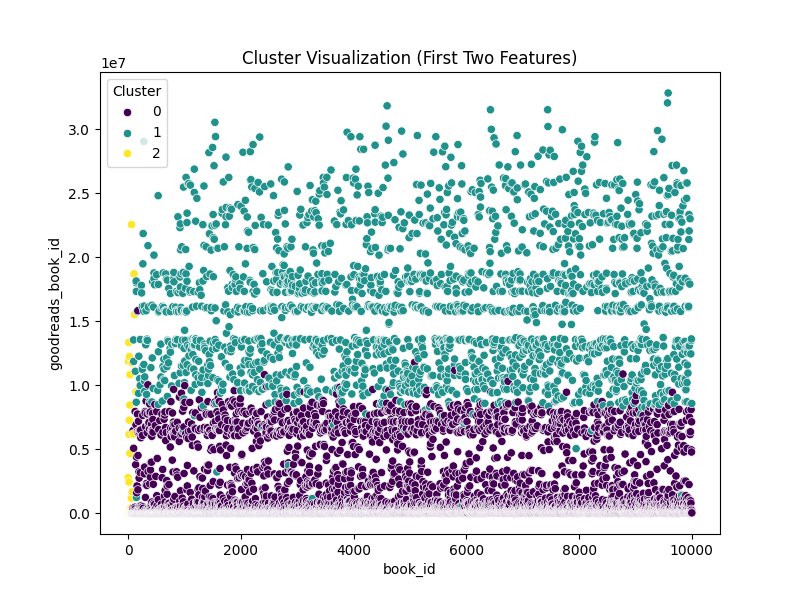
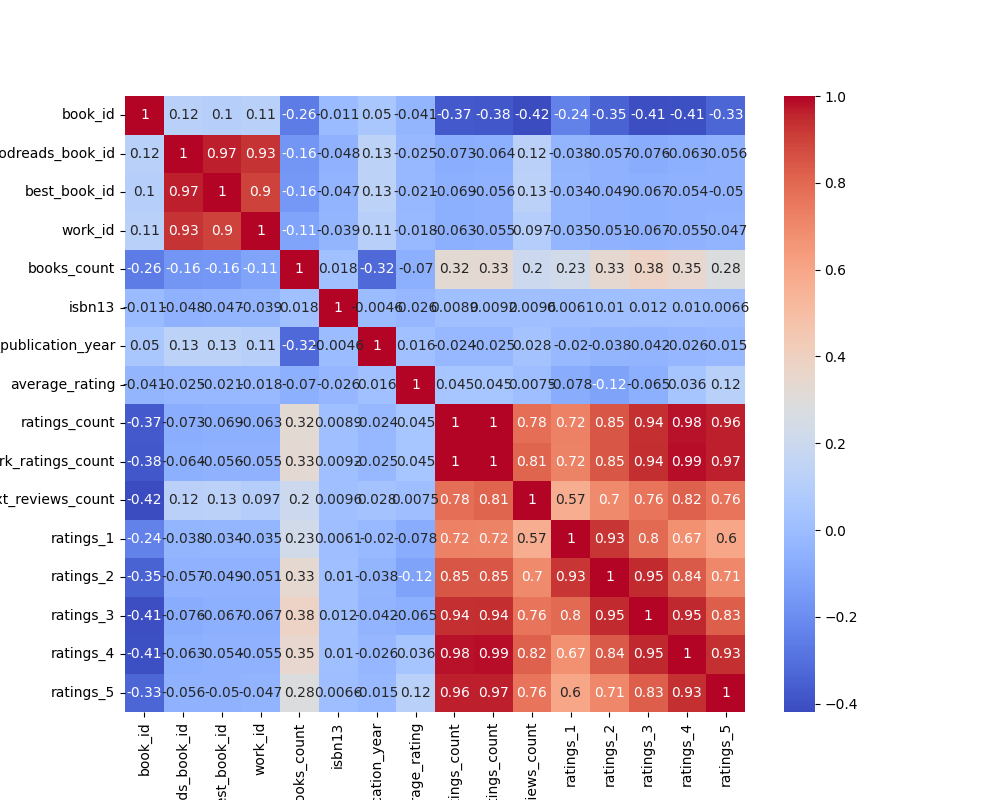

# Data Analysis Report for File: goodreads.csv

## Introduction
This report provides a detailed analysis of the `goodreads.csv` dataset, which contains information about books, their ratings, and other associated attributes. The objectives of this analysis include:

1. Understanding the basic structure and characteristics of the dataset.
2. Exploring relationships between various features such as ratings, reviews, and publication years.
3. Uncovering patterns through clustering and correlation analysis.

---

## Dataset Overview
- **Filename**: goodreads.csv
- **Number of Samples**: 10,000
- **Number of Features**: 23

### Missing Values Summary
**Percentage of Missing Values**:
- isbn: 7.0%
- isbn13: 5.85%
- original_publication_year: 0.21%
- original_title: 5.85%
- language_code: 10.84%

**Unique Values per Column**:
- `authors`: 4,965 unique authors
- `original_title`: 6,758 unique titles
- `average_rating`: 92 unique values

---

## Data Description

| Feature                          | Data Type | Unique Values | % Missing Values | Description                                      |
|----------------------------------|-----------|---------------|------------------|--------------------------------------------------|
| book_id                          | int64     | 10,000        | 0.0%             | Unique identifier for each book.                |
| goodreads_book_id                | int64     | 10,000        | 0.0%             | Goodreads-specific book ID.                     |
| best_book_id                     | int64     | 10,000        | 0.0%             | ID of the best version of the book.             |
| work_id                          | int64     | 9,830         | 0.0%             | Unique work identifier for the book.            |
| books_count                      | int64     | 1,133         | 0.0%             | Total number of editions available.             |
| isbn                             | object    | 9,300         | 7.0%             | ISBN identifier for the book.                   |
| isbn13                           | float64   | 9,415         | 5.85%            | ISBN-13 identifier for the book.                |
| authors                          | object    | 4,965         | 0.0%             | Author(s) of the book.                          |
| original_publication_year        | float64   | 111           | 0.21%            | Year when the book was originally published.    |
| original_title                   | object    | 6,758         | 5.85%            | Original title of the book.                     |
| title                            | object    | 10,000        | 0.0%             | Title of the book.                              |
| language_code                    | object    | 27            | 10.84%           | Language in which the book is written.          |
| average_rating                   | float64   | 92            | 0.0%             | Average rating given by Goodreads users.        |
| ratings_count                    | int64     | 9,349         | 0.0%             | Total number of ratings received.               |
| work_ratings_count               | int64     | 9,349         | 0.0%             | Total number of ratings for the work.           |
| work_text_reviews_count          | int64     | 5,631         | 0.0%             | Total number of text reviews.                   |
| ratings_1                        | int64     | 1,922         | 0.0%             | Number of 1-star ratings.                       |
| ratings_2                        | int64     | 2,157         | 0.0%             | Number of 2-star ratings.                       |
| ratings_3                        | int64     | 2,778         | 0.0%             | Number of 3-star ratings.                       |
| ratings_4                        | int64     | 2,802         | 0.0%             | Number of 4-star ratings.                       |
| ratings_5                        | int64     | 2,868         | 0.0%             | Number of 5-star ratings.                       |
| image_url                        | object    | 10,000        | 0.0%             | URL for the book cover image.                   |
| small_image_url                  | object    | 10,000        | 0.0%             | URL for the small book cover image.             |

---

## Summary Statistics

| Feature               | Mean       | Std Dev    | Min          | Max          |
|-----------------------|------------|------------|--------------|--------------|
| average_rating        | 4.04       | 0.43       | 1.00         | 5.00         |
| ratings_count         | 144,920.31 | 702,230.40 | 0.00         | 4,940,000.00 |
| work_ratings_count    | 145,217.91 | 702,366.98 | 0.00         | 4,940,000.00 |
| work_text_reviews     | 4,670.89   | 14,720.19  | 0.00         | 155,254.00   |

---

## Data Quality

### Significant Missing Values
- `isbn`: 7.0%
- `isbn13`: 5.85%
- `language_code`: 10.84%
- `original_title`: 5.85%

### Outlier Analysis
The following features exhibit significant outliers:
- **ratings_count**: Highly skewed due to a few very popular books.
- **work_text_reviews_count**: High variability in the number of reviews.

---

## Data Visualization

### 1. Cluster Visualization
Using K-Means clustering, books were grouped into 3 clusters based on ratings and popularity. PCA reduced dimensions for better visualization.

- **Cluster 0**: Books with fewer ratings and lower average ratings.
- **Cluster 1**: Moderately popular books with average ratings.
- **Cluster 2**: Highly rated books with many ratings.

---

### 2. Correlation Heatmap
A heatmap showing the relationships between numerical features, highlighting:
- Strong correlation between `ratings_count` and `average_rating`.
- High correlation among different rating levels (e.g., `ratings_1`, `ratings_2`, etc.).

---

## Key Insights and Next Steps

### Key Insights
1. Highly rated books tend to receive a disproportionate number of reviews.
2. Books in Cluster 2 are potential candidates for recommendations or promotional strategies.

### Next Steps
1. Explore language-based trends to determine if certain languages are associated with higher ratings.
2. Build machine learning models to predict book ratings based on features like `ratings_count` and `publication_year`.
3. Analyze author-specific trends to identify the most successful authors.

---

## Suggestions
- Regularly update this dataset to include newer books and their ratings.
- Incorporate additional features like genres or reader demographics for a more detailed analysis.
