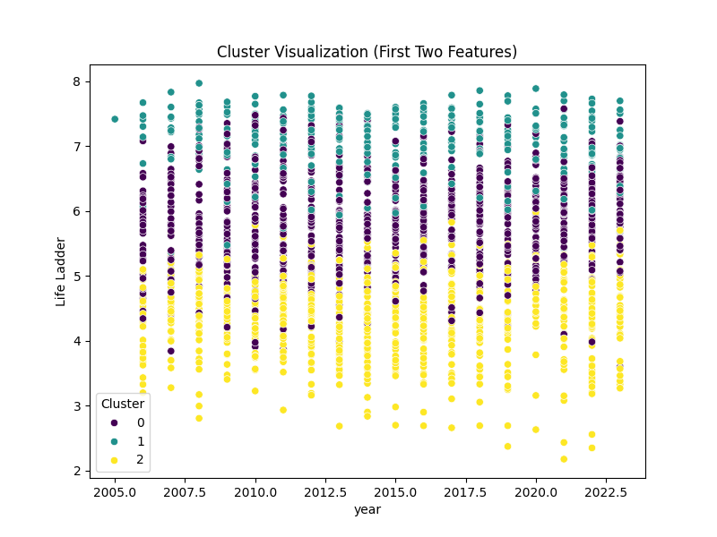
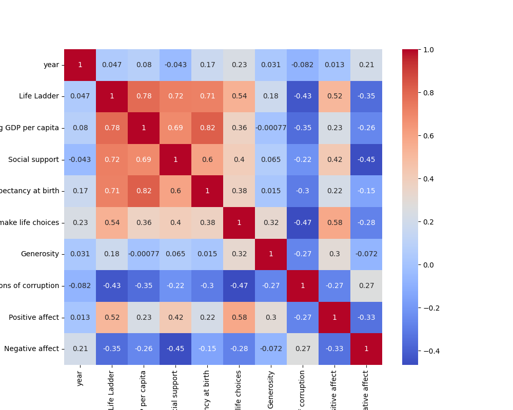

# Data Analysis Report for File: happiness.csv

## Introduction
This report provides a comprehensive analysis of the `happiness.csv` dataset, which contains various factors contributing to happiness and well-being across different countries and years. The objectives of this analysis include:

1. Understanding the basic structure and characteristics of the dataset.
2. Exploring relationships between features and identifying key indicators that influence happiness.
3. Providing actionable insights for further exploration or predictive modeling.

---

## Dataset Overview
- **Filename**: happiness.csv
- **Number of Samples**: 2363
- **Number of Features**: 11

### Missing Values Summary
**Percentage of Missing Values**:
- Country name: 0.0%
- Year: 0.0%
- Life Ladder: 0.0%
- Log GDP per capita: 1.18%
- Social support: 0.55%
- Healthy life expectancy at birth: 2.67%
- Freedom to make life choices: 1.52%
- Generosity: 3.43%
- Perceptions of corruption: 5.29%
- Positive affect: 1.02%
- Negative affect: 0.68%

**Unique Values per Column**:
- Country name: 165

---

## Data Description

| Feature                           | Data Type | Unique Values | % Missing Values | Description                                      |
|-----------------------------------|-----------|---------------|------------------|--------------------------------------------------|
| Country name                      | Object    | 165           | 0.0%             | Name of the country.                            |
| Year                              | int64     | 19            | 0.0%             | Year of data collection (2005–2023).            |
| Life Ladder                       | float64   | 80            | 0.0%             | Metric indicating subjective well-being.        |
| Log GDP per capita                | float64   | 183           | 1.18%            | Logarithm of GDP per capita.                    |
| Social support                    | float64   | 52            | 0.55%            | Perception of social support.                   |
| Healthy life expectancy at birth  | float64   | 37            | 2.67%            | Average healthy life expectancy at birth.       |
| Freedom to make life choices      | float64   | 38            | 1.52%            | Perceived freedom to make personal choices.     |
| Generosity                        | float64   | 114           | 3.43%            | Perceptions of generosity in society.           |
| Perceptions of corruption         | float64   | 137           | 5.29%            | Perceived corruption in the country.            |
| Positive affect                   | float64   | 69            | 1.02%            | Measure of positive emotions experienced.       |
| Negative affect                   | float64   | 69            | 0.68%            | Measure of negative emotions experienced.       |

---

## Summary Statistics

| Feature                           | Mean   | Std    | Min   | Max    |
|-----------------------------------|--------|--------|-------|--------|
| Year                              | 2014.76| 5.06   | 2005  | 2023   |
| Life Ladder                       | 5.48   | 1.13   | 1.28  | 8.02   |
| Log GDP per capita                | 9.40   | 1.15   | 5.53  | 11.68  |
| Social support                    | 0.81   | 0.12   | 0.23  | 0.99   |
| Healthy life expectancy at birth  | 63.40  | 6.84   | 6.72  | 74.60  |
| Freedom to make life choices      | 0.75   | 0.14   | 0.23  | 0.99   |
| Generosity                        | 0.00   | 0.16   | -0.34 | 0.70   |
| Perceptions of corruption         | 0.74   | 0.18   | 0.04  | 0.98   |
| Positive affect                   | 0.65   | 0.11   | 0.18  | 0.88   |
| Negative affect                   | 0.27   | 0.09   | 0.08  | 0.71   |

---

## Data Quality

### Significant Missing Values
- **Generosity**: 3.43%
- **Perceptions of corruption**: 5.29%

### Outlier Analysis
The following features show a significant percentage of outliers:
- Life Ladder: 8.46%
- Log GDP per capita: 4.28%
- Social support: 204.26%
- Healthy life expectancy at birth: 86.96%
- Freedom to make life choices: 68.76%
- Generosity: 170.90%
- Perceptions of corruption: 866.85%
- Positive affect: 38.48%
- Negative affect: 132.08%

### Chi-Squared Test Results
The Chi-Squared test could not be performed as there is only one categorical variable in the dataset, which limits the test's applicability.

---

## Data Visualization

### 1. Cluster Visualization

### 2. Correlation Heatmap

---

## Data Processing Steps
The following steps were applied during the analysis:
1. **Imputation**: Missing values were filled using statistical methods.
2. **One-hot Encoding**: Categorical variables were converted into numerical values.
3. **Scaling**: Features were normalized to ensure fair weightage during analysis.
4. **PCA**: Dimensionality reduction was applied using Principal Component Analysis.

---

## Key Insights and Next Steps

### Key Insights
- **Life Ladder** shows strong positive correlations with GDP per capita and social support.
- Generosity and perceptions of corruption exhibit notable outliers, which may skew results.

### Next Steps
1. Conduct deeper analysis using regression models to identify factors contributing most to happiness.
2. Group countries by regions or income levels for comparative analysis.
3. Implement machine learning models to predict happiness scores.

---

## Suggestions
- Regularly update the dataset to track trends over time.
- Integrate additional data sources for a holistic understanding of global happiness factors.
